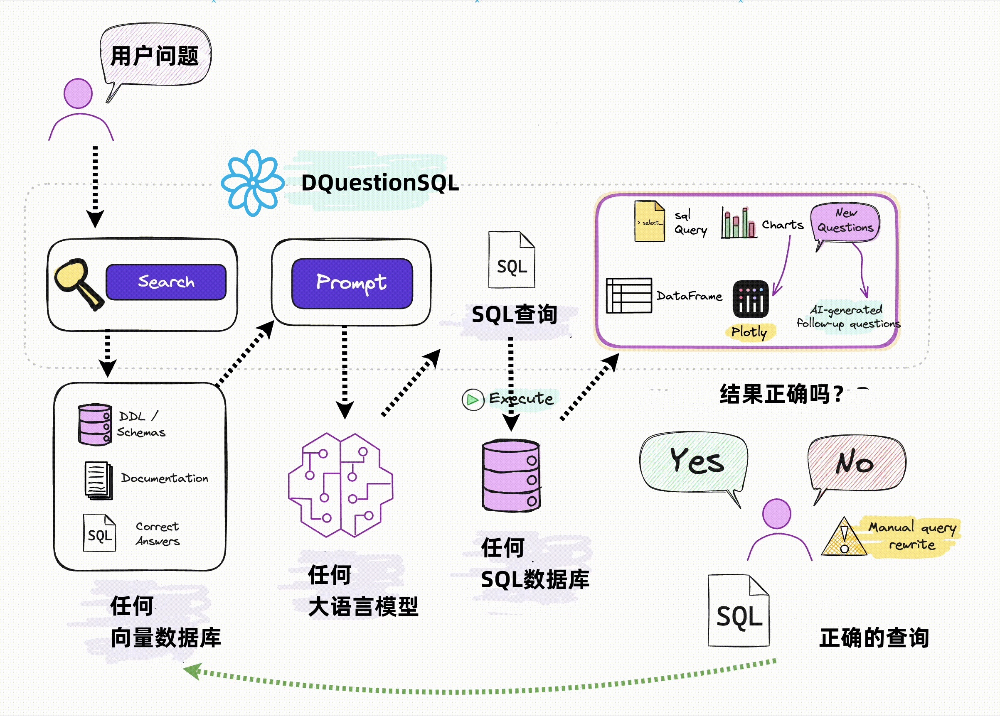
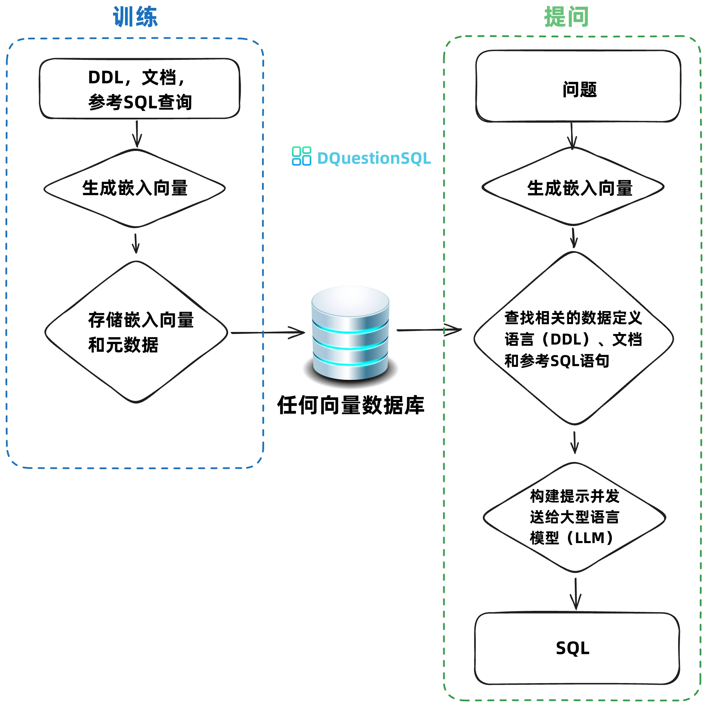
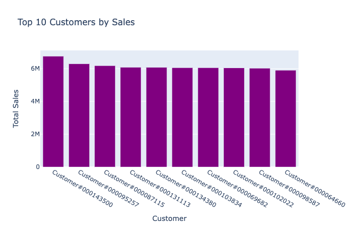

# DQuestion
DQuestion 是一个 基于 Python RAG（检索增强生成）框架，用于 SQL 生成和相关功能。

## DQuestion 如何工作

DQuestion 通过两个简单的步骤工作 - 在您的数据上训练一个 RAG "模型"，然后提出问题，这些问题将返回可以设置为自动在您的数据库上运行的 SQL 查询。

1. **在您的数据上训练一个 RAG "模型"**。
2. **提出问题**。



如果您不知道 RAG 是什么，不用担心 - 您不需要知道它是如何在底层工作的就能使用它。您只需要知道您 "训练" 一个模型，该模型存储一些元数据，然后使用它来 "提问"。

### 导入
如果您正在自定义 LLM 或向量数据库。

```python
# 导入语句将根据您的 LLM 和向量数据库而有所不同。这是 OpenAI + ChromaDB 的示例

from dquestion.openai.openai_chat import OpenAI_Chat
from dquestion.chromadb.chromadb_vector import ChromaDB_VectorStore

class MyDQuestion(ChromaDB_VectorStore, OpenAI_Chat):
    def __init__(self, config=None):
        ChromaDB_VectorStore.__init__(self, config=config)
        OpenAI_Chat.__init__(self, config=config)

dq = MyDQuestion(config={'api_key': 'sk-...', 'model': 'gpt-4-...'})

# 查看文档以获取其他选项

```

## 训练
根据您的用例，您可能需要或不需要运行这些 `dq.train` 命令。

这些语句是为了让您了解其工作原理。

### 使用 DDL 语句训练
DDL 语句包含有关数据库中表名、列、数据类型和关系的信息。

```python

dq.train(ddl="""
    CREATE TABLE IF NOT EXISTS my-table (
        id INT PRIMARY KEY,
        name VARCHAR(100),
        age INT
    )
""")
```

### 使用文档训练
有时您可能想要添加有关您的业务术语或定义的文档。

```python
dq.train(documentation="Our business defines XYZ as ...")
```

### 使用 SQL 训练
您还可以将 SQL 查询添加到训练数据中。如果您已经有一些查询，这将非常有用。您可以直接从编辑器复制并粘贴它们以开始生成新的 SQL。

```python
dq.train(sql="SELECT name, age FROM my-table WHERE name = 'John Doe'")
```

## 提问
```python
dq.ask("What are the top 10 customers by sales?")
```

您将得到 SQL
```sql
SELECT c.c_name as customer_name,
        sum(l.l_extendedprice * (1 - l.l_discount)) as total_sales
FROM   snowflake_sample_data.tpch_sf1.lineitem l join snowflake_sample_data.tpch_sf1.orders o
        ON l.l_orderkey = o.o_orderkey join snowflake_sample_data.tpch_sf1.customer c
        ON o.o_custkey = c.c_custkey
GROUP BY customer_name
ORDER BY total_sales desc limit 10;
```

如果您已连接到数据库，您将得到一个表格：
<div>
<table border="1" class="dataframe">
  <thead>
    <tr style="text-align: right;">
      <th></th>
      <th>CUSTOMER_NAME</th>
      <th>TOTAL_SALES</th>
    </tr>
  </thead>
  <tbody>
    <tr>
      <th>0</th>
      <td>Customer#000143500</td>
      <td>6757566.0218</td>
    </tr>
    <tr>
      <th>1</th>
      <td>Customer#000095257</td>
      <td>6294115.3340</td>
    </tr>
    <tr>
      <th>2</th>
      <td>Customer#000087115</td>
      <td>6184649.5176</td>
    </tr>
    <tr>
      <th>3</th>
      <td>Customer#000131113</td>
      <td>6080943.8305</td>
    </tr>
    <tr>
      <th>4</th>
      <td>Customer#000134380</td>
      <td>6075141.9635</td>
    </tr>
    <tr>
      <th>5</th>
      <td>Customer#000103834</td>
      <td>6059770.3232</td>
    </tr>
    <tr>
      <th>6</th>
      <td>Customer#000069682</td>
      <td>6057779.0348</td>
    </tr>
    <tr>
      <th>7</th>
      <td>Customer#000102022</td>
      <td>6039653.6335</td>
    </tr>
    <tr>
      <th>8</th>
      <td>Customer#000098587</td>
      <td>6027021.5855</td>
    </tr>
    <tr>
      <th>9</th>
      <td>Customer#000064660</td>
      <td>5905659.6159</td>
    </tr>
  </tbody>
</table>
</div>

您还将得到一个自动化的 Plotly 图表：


## RAG 与微调
RAG
- 可在 LLM 之间移植
- 如果任何训练数据变得过时，易于移除
- 运行成本比微调便宜得多
- 更具有未来证明性 - 如果有更好的 LLM 出现，您可以直接替换它

微调
- 如果您需要在提示中最小化标记，则效果很好
- 启动缓慢
- 训练和运行成本较高（通常）

## 为什么选择 DQuestion？

1. **在复杂数据集上具有高准确性。**
    - DQuestion 的能力与您提供的训练数据有关
    - 更多的训练数据意味着对于大型和复杂数据集的准确性更好
2. **安全且私密。**
    - 您的数据库内容从未发送到 LLM 或向量数据库
    - SQL 执行发生在您的本地环境中
3. **自我学习。**
    - 如果通过 Jupyter 使用，您可以选择在成功执行的查询上 "自动训练" 它
    - 如果通过其他界面使用，您可以让界面提示用户提供对结果的反馈
    - 正确的问题到 SQL 对存储用于将来参考，并使未来结果更准确
4. **支持任何 SQL 数据库。**
    - 该包允许您连接到任何您可以通过 Python 连接的 SQL 数据库
5. **任意选择您的前端。**
